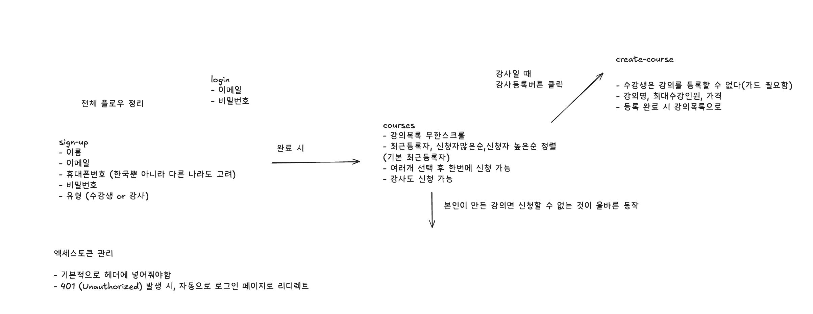
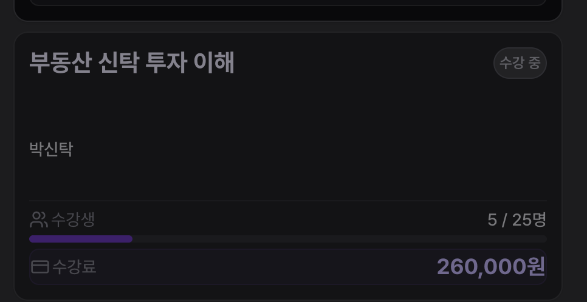

### 실행방법

먼저 `backend_mock.tar` 이미지를 다운받아주세요.

```bash
# 1. API 애플리케이션 이미지 로드
docker load -i backend_mock.tar

# 2. 서버 실행
docker run --rm -p 8080:8080 backend_mock_for_assignment-api:latest
```

이후 의존성 설치를 진행하고 실행합니다.

```bash
npm install
npm run dev
```

### 전체 플로우 구조



### 사용한 라이브러리

- **ky**: Next.js와 호환성이 좋은 HTTP 클라이언트 라이브러리
- **tanstack query**: 서버 상태 관리에 사용
- **radix-ui**: UI 컴포넌트 라이브러리 (Radix UI)
- **react-intersection-observer**: 무한 스크롤 구현에 사용
- **biome**: 프로젝트 포맷팅 및 린트
- **react-hook-form + zod**: 폼 유효성 검증에 사용
- **nuqs**: URL 쿼리 파라미터 상태 관리에 사용

### 폴더 구조

```text
app/
├── (route)/          # 도메인별 페이지 구성 (강의신청, 로그인 등)
├── components/       # 공통 UI 컴포넌트
├── hooks/            # 전역 커스텀 훅
├── provider-groups/  # Query, Theme 등 프로바이더 설정
└── globals.css       # 전역 스타일링
components/           # 공통 UI 컴포넌트 (Shadcn UI 스타일)
lib/                  # 유틸리티 및 클라이언트 설정 (http-client 등)
types/                # 공통 타입 정의
```

### 추가적으로 고려한 부분

- **데이터 프리패칭(Prefetching) 및 무한 스크롤**: 세 가지 정렬 기준(최신순, 인기순, 평점순)에 대해 미리 데이터를 패칭하여 탭 전환 및 스크롤 시 끊김 없는 사용자 경험을 제공합니다.
- **선언적 UI 관리**: React Suspense와 Error Boundary를 적극 활용하여 로딩 및 에러 상태를 선언적으로 관리, 서비스의 안정성을 높였습니다.
- **URL 기반 상태 관리**: `nuqs`를 통해 정렬 상태를 URL 파라미터와 동기화하여 페이지 새로고침 시에도 상태가 유지되고 공유 가능하도록 했습니다.
- **비즈니스 로직 제어**: 본인이 직접 등록한 강의는 수강 신청 목록에 담을 수 없도록 예외 처리를 적용하여 정합성을 유지했습니다.
- **사용자 경험(UX) 최적화**: 직관적인 강의 카드 디자인, 하단 고정형 CTA 버튼(Bottom CTA) 등을 통해 모바일과 데스크탑 모두에서 편안한 접근성을 제공합니다.


### 추가기능

- **수강 중 상태 관리 및 표시**: `react-simplikit`의 `useStorageState`를 활용하여 수강 신청이 완료된 강의 목록을 로컬 스토리지와 동기화하고 앱 전역에서 일관된 상태를 유지합니다.
- **수강 신청 제한 기능**:
    - **본인 등록 강의**: 본인이 직접 등록한 강의는 수강 신청 목록에 담을 수 없도록 하여 비즈니스 로직의 정합성을 보장합니다.
    - **중복 수강 제한**: 이미 수강 중인 강의는 '수강 중' 배지와 함께 선택이 불가능하도록 비활성화 처리하여 중복 신청을 방지합니다.
- **유동적인 UI 피드백**: '수강 중'이거나 '정원 마감'인 강의는 카드 투명도 및 커서 스타일 변경을 통해 사용자에게 즉각적인 상태 정보를 전달합니다.




### 에러처리

스웨거문서에서, API 에러시 공통된 응답을 받는 것을 확인했습니다.

앱 전역에서 사용될 수 있는 `ErrorResponse`클래스를 만들어, 해당 클래스를 이용해 에러처리를 하였습니다

```tsx
//200대가 아닌 오류 발생시 코드,메시지,타임스탬프
interface ApiErrorBody {
  code: string;
  message: string;
  timestamp: string;
}

export class ErrorResponse extends Error {
  readonly code: string;
  readonly timestamp: string;
  readonly status: number;

  constructor({
    code,
    message,
    timestamp,
    status,
  }: ApiErrorBody & { status: number }) {
    super(message);
    this.name = 'ErrorResponse';
    this.code = code;
    this.timestamp = timestamp;
    this.status = status;
  }
}

//onError fallback
if (e instanceof ErrorResponse) {
  toast.error(e.message);
}
```

### 수강신청화면에서의 SSR

수강신청 화면에서 사용자 경험을 위해 각 필터별로 SSR을 도입했습니다.

첫 화면에 진입했을 때 로딩화면이 보이는게 아니라 강의목록이 채워진 채로 사용자에게 보여지는 것이 더 나은 경험이라고 생각해 도입했습니다.

`prefetchInfinityQuery`를 각 필터 ( 최신순, 수강생 많은 순, 가격 높은/낮은 순 ) 별로 미리 실행해둡니다.

이떄 `Promise.allSettled`를 사용해, 특정 필터의 데이터가 오지 않더라도 나머지 필터의 데이터는 사용자에게 보여줄 수 있도록 합니다.

<video controls src="화면 기록 2026-02-14 오후 1.15.07.mov" title="Title"></video>
